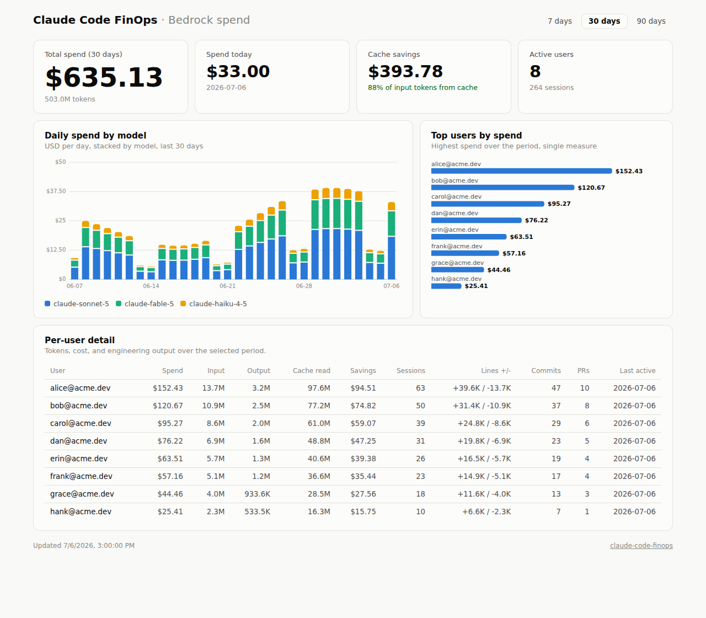
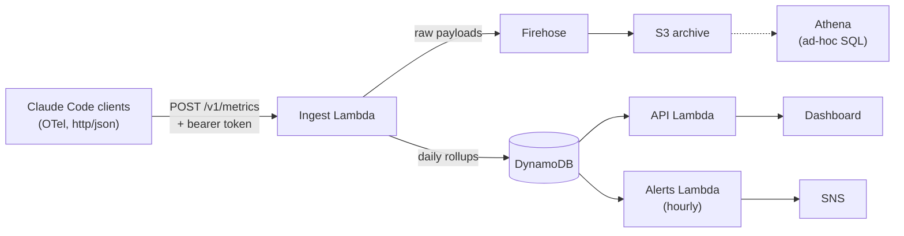

# claude-code-finops

Per-developer, per-team, per-model cost visibility for Claude Code running on Amazon Bedrock.

I built this because every Claude Code rollout I've been near hits the same wall: Cost Explorer shows one growing Bedrock line item and nothing else. Nobody can say who is spending what, whether prompt caching is actually saving money, or why the bill doubled on a Tuesday. Claude Code already emits everything you need to answer those questions ([it has native OpenTelemetry support](https://code.claude.com/docs/en/monitoring-usage)); what's missing is somewhere for that telemetry to land. This is that somewhere.



It deploys as one SAM stack. There are no servers to run, no collector fleet, no Prometheus, and no third-party SaaS seeing your usage data. At typical org sizes the pipeline costs a few dollars a month.

## What you get

The dashboard shows total and daily spend stacked by model, top users, cache savings, and a per-user table that pairs cost with output: lines of code, commits, and PRs over the same period. That last part matters more than it sounds, because "spend went up" is a very different conversation when you can see output went up with it. Light and dark mode, 7/30/90-day ranges.

Alerts run hourly against the same rollups: month-to-date budget thresholds (global and per-team) and a spike detector that compares each user's spend today against their trailing 7-day average. The spike alert is the one you want, because it's the "an agent looped all night" alarm.

Every raw OTLP payload also lands in S3 behind a Glue table, so anything the dashboard doesn't answer is one Athena query away. And `scripts/reconcile.py` compares telemetry-derived cost against the actual Bedrock charges in Cost Explorer, day by day, so the estimates stay honest.

## How it works



Clients export token counts, cost, sessions, and engineering activity, tagged with user identity and whatever custom attributes you configure (team, cost center). The ingest Lambda parses OTLP JSON and maintains daily rollups per user, model, and team. One detail I sweated: clients misconfigured for cumulative (rather than delta) temporality get converted using per-session state, so nothing double-counts either way.

## Deploy

You need the [AWS SAM CLI](https://docs.aws.amazon.com/serverless-application-model/latest/developerguide/install-sam-cli.html), an AWS account, and Python 3.12.

```bash
git clone https://github.com/gradientmethods/claude-code-finops
cd claude-code-finops

# generate two secrets
openssl rand -hex 24   # -> IngestToken
openssl rand -hex 24   # -> DashboardToken

sam deploy --guided
```

The guided deploy asks for the two tokens plus optional budgets and an alert email. The stack outputs give you the ingest endpoint (what clients set as `OTEL_EXPORTER_OTLP_ENDPOINT`) and the dashboard URL. Client configuration is five environment variables, or one managed-settings block for an org-wide rollout; see [client-setup/](client-setup/README.md). Data shows up about a minute after the first session.

## The numbers, defined

| Field | Source |
|---|---|
| Spend | `claude_code.cost.usage` as reported by Claude Code; falls back to the token-based estimate when absent |
| Estimated spend | tokens x Bedrock list pricing (`src/shared/pricing.py`; override via the `PRICING_JSON` env var) |
| Cache savings | cacheRead tokens x input rate x 90%: what those tokens would have cost fresh, minus the 10% cache-read rate actually billed |
| Lines / commits / PRs | `claude_code.lines_of_code.count`, `claude_code.commit.count`, `claude_code.pull_request.count` |
| Team | first of `team.id`, `team`, `department`, `cost_center` in `OTEL_RESOURCE_ATTRIBUTES` |

For billing-grade team attribution (the kind Finance reconciles), pair the telemetry with Bedrock application inference profiles and cost allocation tags; [docs/bedrock-cost-attribution.md](docs/bedrock-cost-attribution.md) walks through the pattern and why you want both views.

## Ad-hoc analysis with Athena

The raw archive keeps full OTLP payloads (90-day retention by default), partitioned by date in the `claude_code_finops.raw_events` table:

```sql
SELECT dt, count(*) AS exports
FROM claude_code_finops.raw_events
WHERE dt >= date_format(current_date - interval '7' day, '%Y-%m-%d')
GROUP BY dt ORDER BY dt;
```

Run `MSCK REPAIR TABLE claude_code_finops.raw_events` (or add partitions on a schedule) to pick up new dates.

## Security notes

Both API surfaces require bearer tokens, and ingest and dashboard use different ones; rotate by updating the stack parameters. The dashboard shows user emails and spend, so treat its token accordingly, and for production consider putting it behind your SSO. Raw payloads contain metadata only, no prompt or code content, unless you deliberately enable content logging in Claude Code. The S3 bucket blocks public access and encrypts at rest.

## Development

```bash
pip install -r requirements-dev.txt
make test   # 35 unit tests, no AWS credentials needed
make lint   # cfn-lint on the template
```

## Roadmap

Tokens-per-merged-PR as a first-class view, a Slack alert formatter, OTLP protobuf ingest, and a per-repo attribution recipe via directory-scoped settings.

## License

MIT. Built by [Gradient Methods](https://gradientmethods.com), an applied AI and cloud consultancy. If you're rolling out Claude Code across an engineering organization and want help doing it well, [get in touch](https://gradientmethods.com/pages/contact.html).
